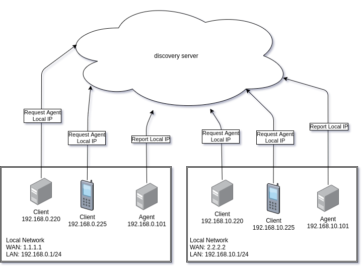

# Discovery

This project enables very simple service discovery on your local network. With just two http calls clients and providers
can find each other.

## How it works



This service know 2 API calls: [an agent reporting its local IP address](#call-report-ip) and [a client requesting an agent IP address](#call-request-ip).

Agents are identified by three values:
 - The public IP address of the local network
 - The service ID
 - The agent ID

### <a name="call-report-ip"></a>Reporting an agent IP address

To register an agent with the discovery server you make a simple HTTP request:

```bash
curl "https://agent-discovery.herokuapp.com/io.chapp.discovery?agent_id=288cec4b-d04c-4c82-8212-7fd3fb015718&private_address=192.168.178.101:8888"

{
   "service_id":"io.chapp.discovery",
   "public_ip":"80.56.113.90",
   "agents":[
      {
         "agent_id":"288cec4b-d04c-4c82-8212-7fd3fb015718",
         "private_address":"192.168.178.101:8888"
      }
   ]
}
```

`GET https://agent-discovery.herokuapp.com/[SERVICE_ID]?agent_id=[AGENT_ID]&private_address=[HOST:PORT]`

| Parameter         | Description | Example |
| ----------------- | ----------- | ------- |
| `SERVICE_ID`      | The service ID is the primary ID which clients use to find agents. It is import that you choose a unique ID here. Use the following convention: Start with reverting a domain name you own and suffix this with your project name. | I own `chapp.io` so my service id is: `io.chapp.discovery`. |
| `AGENT_ID`        | This ID is used to determine if a private address should be updated or added to the list. Set this to a value that is unique within your service. | A uuidv4 will work: `6eff0004-e6d0-4f78-8369-01865eb1707c` |
| `PRIVATE_ADDRESS` | This is where an agent will describe its local address. Make sure it inclused both the **local** IP address and port number. | `192.168.0.101:8888` |

### <a name="call-request-ip"></a>Requesting a list of agents

To get a list of agents on your local network the call is even simpler:

```bash
curl "https://agent-discovery.herokuapp.com/io.chapp.discovery"

{
   "service_id":"io.chapp.discovery",
   "public_ip":"80.56.113.90",
   "agents":[
      {
         "agent_id":"288cec4b-d04c-4c82-8212-7fd3fb015718",
         "private_address":"192.168.178.101:8888"
      }
   ]
}
```

| Parameter         | Description                                                     | Example              |
| ----------------- | --------------------------------------------------------------- | -------------------- |
| `SERVICE_ID`      |  Use the same service ID you used while registering your agent. | `io.chapp.discovery` |

## Caveats

Since I developed this only for a hobby project, all references to agents are kept in-memory.
his means that with any crash or redeployment, the agent lists are cleared.
To make sure your agent remains in the list, I recommend you register your agent **every 10 minutes** while it is running.

If anyone expresses further interest in using this service, I might enhance the state management solution and introduce some sort of database.